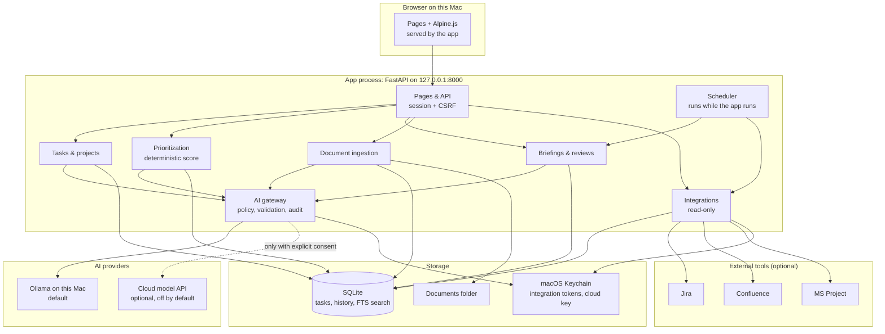
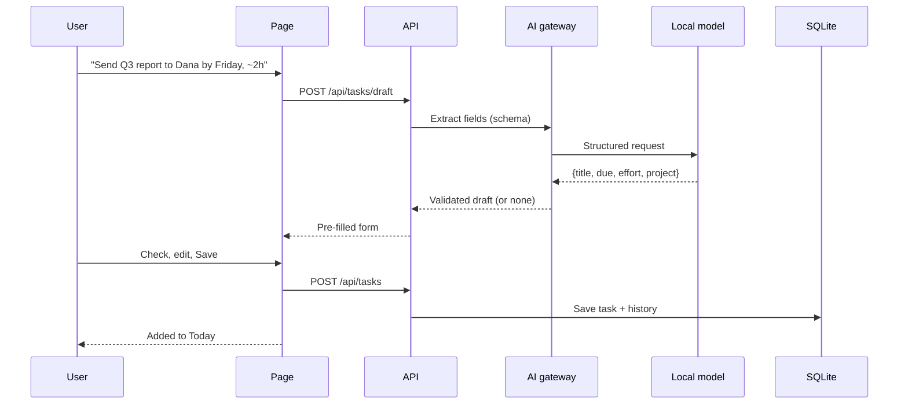
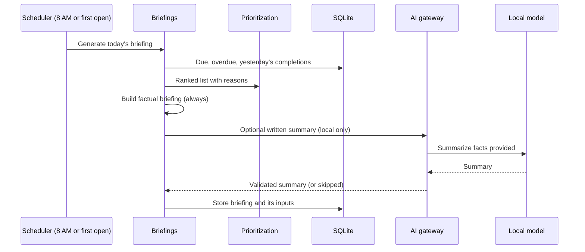

# Productivity Assistant: design

A personal task and planning assistant that runs on your own Mac. It captures
tasks in plain language, keeps a prioritized list, writes a morning briefing and
an evening review, and can read your documents and work tools. AI helps with
the tedious parts; you stay in control of what gets saved and what leaves the
machine.

**Status:** Phase 1 (core, no AI) and AI capture (M4) implemented and tested;
the rest of Phases 2–5 are proposals. Performance figures are targets, not measurements.

## Design principles

These decide every trade-off below.

1. **Useful without AI.** Capturing, editing, prioritizing and the factual part of
   the briefing work with no model running. AI makes them faster, not possible.
2. **AI proposes; you confirm.** A model never saves, changes or deletes
   anything on its own. It fills in a draft that you accept, edit or discard.
3. **Local by default.** Your tasks and documents stay on this Mac. A cloud
   model is an explicit opt-in, per request, never a silent fallback.
4. **Explainable.** Every priority and every AI suggestion shows why.
5. **Few moving parts.** One app process and one database file. Add
   infrastructure only when a measured need appears.
6. **Easy to leave.** Everything can be exported to open formats at any time.

## What it does

| Capability | Without AI | With AI |
| --- | --- | --- |
| Quick capture | Type a task; fill in due date, project and effort yourself | "Send Q3 report to Dana by Friday, about 2 hours" becomes a pre-filled draft to confirm |
| Prioritized list | Ranked by a transparent score (see [Prioritization](#prioritization)) | Suggests adjustments with a stated reason; you accept or dismiss |
| Morning briefing | Today's due, overdue and top-ranked tasks, and yesterday's completions | Adds a short written summary of the day |
| Evening review | What was done, what slipped, what's due tomorrow | Adds a short reflection and suggested carry-overs |
| Documents | Upload and keyword-search files | Extracts candidate tasks and action items for review |
| Work tools | Read-only import from Jira, Confluence or MS Project | Summarizes imported items |

## Architecture

One FastAPI process serves the web pages and the API on `127.0.0.1`. A local model
runs in Ollama. All state lives in one SQLite file.



### Why this shape

- **One process.** The pages are plain HTML with Alpine.js, served by FastAPI.
  No separate frontend server, no build step.
- **No Redis, WebSocket or vector database at the start.** A single-user app
  on one machine doesn't need a cache server. Pages refresh after each action;
  add server-sent events later if live updates prove necessary.
- **The scheduler runs inside the app.** A web page can't wake you at 8 AM, so
  briefings are generated on schedule while the app runs, and **on first open**
  if a scheduled run was missed. A macOS notification is optional (see
  [Running on this Mac](#running-on-this-mac)).
- **All AI goes through one gateway.** That gives a single place to enforce the
  local/cloud policy, validate output, and record what was sent where.

## Components

### Pages (Alpine.js)

- **Quick capture:** always visible. Shows the AI draft as an editable form before saving.
- **Today:** the briefing, the ranked list, and one-click done/snooze/reprioritize.
- **Tasks and projects:** full list with filters, dependencies and history.
- **Review:** the evening review and tomorrow's plan.
- **Documents:** upload, search, and review extracted action items.
- **Settings:** AI providers and consent, integrations, schedule, export and backup.

Each suggestion shows where it came from, for example *"Suggested by local model"* or
*"Imported from Jira PROJ-142"*, and why.

### API

| Endpoint | Purpose |
| --- | --- |
| `GET/POST/PATCH/DELETE /api/tasks` | Task CRUD; every change is recorded in history |
| `POST /api/tasks/draft` | Turn free text into a **draft** (not saved) |
| `GET /api/priorities` | Ranked list with the score breakdown for each task |
| `POST /api/priorities/{id}/override` | Pin, raise or lower a task; recorded as feedback |
| `GET/POST /api/briefings` | Get or regenerate today's briefing or review |
| `POST /api/documents` | Upload; returns extracted text and candidate tasks for review |
| `GET /api/search?q=` | Full-text search across tasks and documents |
| `GET/PUT /api/settings` | Providers, consent, schedule and integrations |
| `GET /api/export` | Everything as JSON and CSV |

Requests are validated with Pydantic, and FastAPI generates the API
documentation automatically.

### AI gateway

Every AI call goes through one component, which enforces these rules in code:

1. **Local first.** Ollama handles all AI work by default, with an allowlisted
   model pinned to its digest (qwen3:0.6b since M4).
2. **Cloud only with consent.** The cloud provider is off until enabled in
   Settings. Even then, each cloud request shows **exactly what will be sent** and
   needs a click to send. Scheduled and background jobs never use the cloud.
3. **Sensitivity decided by rules, not the model.** Projects and documents can be
   marked private (never sent to the cloud). Anything unmarked is treated as
   private unless the user sends it deliberately.
4. **Structured, validated output.** Models return JSON matching a schema.
   Anything malformed is rejected, and the user gets the manual form instead.
5. **Always a way forward.** If the local model is unavailable or slow, the
   feature falls back to its non-AI version. It never falls back to the cloud.
6. **Audit trail.** Each call records its time, feature, provider, model and
   size of input, and whether the user accepted the result. Prompt text is not
   logged by default.

```python
def choose_provider(request, settings):
    """Local by default; cloud only when enabled, allowed and confirmed now."""
    if request.background:                      # scheduled jobs: local only
        return LOCAL
    if not settings.cloud_enabled or request.contains_private_data:
        return LOCAL
    if request.user_confirmed_cloud_send:       # the user saw exactly what goes out
        return CLOUD
    return LOCAL
```

### Prioritization

Priority is a **transparent score**, so you can always see why a task ranks where
it does:

| Factor | Example weight | Notes |
| --- | --- | --- |
| Due date | High | Rises sharply within 2 days; overdue is highest |
| Importance | Medium | Set by you (1–3) |
| Blocking others | Medium | Tasks that other tasks depend on rank higher |
| Effort | Low | Short tasks get a small boost ("quick wins") |
| Age | Low | Old, untouched tasks slowly rise so they aren't forgotten |
| Your override | Final | Pinned or manually moved tasks stay where you put them |

- **AI suggests, never overrides.** It might say: *"Move 'Budget review' up:
  the Q3 report depends on it."* You accept or dismiss.
- **Learning is visible and reversible.** When you often move certain kinds of
  tasks up or down, the app proposes a weight change ("Raise importance of
  'Client' project tasks?"). Weights are shown in Settings and can be reset.

### Document ingestion

- Accepts PDF, DOCX, TXT, CSV and XLSX up to a size limit. Text is extracted
  locally, and originals are kept in the documents folder.
- Search uses SQLite full-text search. Add embeddings (semantic search) only if
  keyword search proves insufficient. They can live in SQLite as well, which
  avoids a separate vector database.
- Candidate tasks from a document or meeting transcript appear in a review list;
  nothing becomes a task until you accept it.

### Integrations

- **Read-only first, one at a time.** Start with the tool you use most (Jira is
  a sensible first choice), import assigned items, and show them alongside your
  own tasks, labeled with their source.
- **Pull, don't push.** The app doesn't change Jira, Confluence or MS Project.
  Two-way sync comes later, per tool, with explicit conflict rules.
- **Tokens live in the macOS Keychain**, never in files or logs. Each
  integration can be disconnected, and its imported data deleted, in one step.
- If a tool is unreachable, the last imported copy stays visible with its
  last-synced time.

## Data

A single SQLite file, in a private folder outside any code repository.

| Table | Contents |
| --- | --- |
| `tasks` | Title, notes, status, due date, importance, effort, project, source |
| `task_dependencies` | Which tasks block which |
| `task_history` | Every change: what, when, and by whom (you, an import or an accepted AI suggestion) |
| `projects` | Projects and their privacy setting |
| `briefings` | Generated briefings and reviews, with their inputs |
| `priority_feedback` | Your overrides, used to propose weight changes |
| `documents` | File metadata and extracted text (with full-text index) |
| `integration_items` | Imported items with source ID and last-synced time |
| `ai_calls` | The audit trail described above |
| `settings` | Preferences, schedule and weights |

**Why SQLite from day one, not JSON files first:** the scheduler and the web pages
write at the same time, and SQLite handles that safely with transactions. JSON
files can be corrupted by an interrupted write. SQLite is still one file, needs no
setup, and supports full-text search and simple, reliable backups. Human-readable
copies come from the export.

## Key flows

### Quick capture



If the model is unavailable or its answer is invalid, the same form appears
with only the title filled in. Capture never fails because of AI.

### Morning briefing



The factual part is always there. The written summary is added when the local
model is available. Background briefings never use the cloud.

## Failure behavior

| Situation | What you see |
| --- | --- |
| Local model not running | Manual forms and the factual briefing; a note in Settings |
| Model answer invalid or too slow | The manual form; the draft is discarded |
| Cloud unavailable or not confirmed | The request stays local; nothing is sent |
| Integration unreachable | Last imported items with their last-synced time |
| App was closed at 8 AM | The briefing is generated when you next open it |
| Interrupted write | SQLite rolls back; the previous state is intact |

## Security and privacy

- **Local only.** The app listens on `127.0.0.1`, never on the network.
- **Browser protections.** Session cookie plus CSRF token on every change, and
  Host/Origin checks, so a malicious web page in another tab can't act on your
  tasks. Loopback binding alone doesn't prevent that.
- **Secrets in the macOS Keychain**, never in files, environment dumps or logs.
- **Encryption at rest through FileVault.** App-level encryption adds key
  management without much benefit for a single-user Mac. Exports and backups can
  be written as encrypted archives.
- **Private data out of source control.** The database, documents, logs and
  exports live outside the code repository.
- **Cloud transparency.** The audit trail shows every cloud request and what was sent.

## Running on this Mac

| Service | Address |
| --- | --- |
| App (pages + API) | `127.0.0.1:8000` |
| Ollama | `127.0.0.1:11434` |

- **Start:** manually at first; optionally at login through a macOS
  **launchd** agent. A menu-bar notification for the briefing is a later option.
- **Backup:** daily SQLite backup to a folder you choose, keeping the last 14
  (a target). A cloud-synced folder such as OneDrive works only as an encrypted
  archive, and only if you choose it, because it sends your data off the Mac.
- **Logs:** structured JSON, rotated, without task or document text by default.

## Technology choices

| Choice | Why |
| --- | --- |
| **FastAPI** | Typed request validation with Pydantic, automatic API docs, async file handling, and easy use of Python AI and document libraries. |
| **Alpine.js** | Small, reactive pages served directly by the app; no build step or separate frontend server. |
| **SQLite** | Transactions, full-text search and one-file backups with no setup. Enough for one user for a long time. |
| **Ollama, local by default** | Private and free to run. Cloud is an explicit, audited opt-in for requests that need a larger model, through a provider-neutral adapter (see [Open decisions](#open-decisions)). |

Deferred until a measured need appears: Redis, WebSocket, a separate vector
database, and multi-user support. Multi-user support would require a redesign
(accounts, network exposure, per-user data), not a small extension.

## Roadmap

| Phase | Delivers | Done when |
| --- | --- | --- |
| 1. Core | Tasks, projects, dependencies, transparent prioritization, factual briefing and review, export, backup | Usable every day with no AI at all |
| 2. Local AI | Capture drafts, briefing summaries, priority suggestions, all through the gateway | Drafts are accepted without edits most of the time (target set during testing) |
| 3. Documents | Upload, full-text search, candidate tasks from documents and transcripts | Action items are found and reviewed without retyping |
| 4. Integrations | Read-only Jira first, then Confluence, then MS Project | Imported work appears on Today with its source |
| 5. Optional cloud | The chosen cloud model behind consent and the audit trail | Enabled only by choice; every send is visible |

## Open decisions

1. **Should the cloud be allowed at all, and which provider?** The design supports
   "never" and "opt-in per request". The provider is a swappable adapter behind
   the AI gateway. Choose before Phase 5:
   - **First, check whose data it is.** Imported Jira, Confluence and MS Project
     content usually belongs to an employer, whose approved-AI policy may decide
     the provider or rule out the cloud for work content.
   - **Candidates:** IBM watsonx.ai (Granite models, also runnable locally),
     Anthropic Claude, OpenAI, Google Gemini, or Azure OpenAI / AWS Bedrock where
     an employer's cloud account and contracts apply. (IBM Bob is a coding
     assistant for developers, not a model API an app can call.)
   - **Decide on:** data retention and training terms, native JSON-schema output,
     and quality on 20–30 of your own capture and briefing examples.
2. **Which integration comes first,** and is read-only enough for the first year?
3. **Which local model** gives acceptable capture quality and speed on this Mac?
   Measure before Phase 2 and record the results.
4. **Briefing time and review time,** and whether a macOS notification is wanted.
