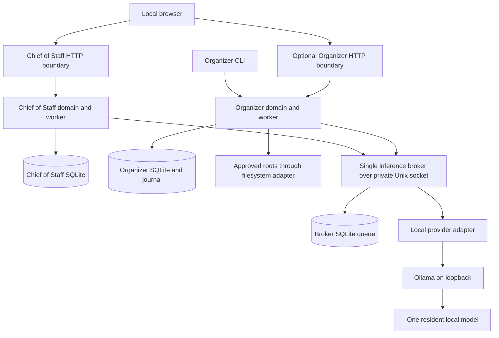

# Shared architecture

Proposed, 2026-09-17. Requirement and milestone definitions: [index](README.md#requirements-and-acceptance-map). Nothing here implies existing production functionality.

## Boundaries and stack

R-01, R-11: this dedicated repository will contain `apps/chief_of_staff`, `apps/organizer`, `shared`, and synthetic `tests`. Independent Python entry points: Chief of Staff web app; Organizer CLI with optional slim web review; shared inference broker. These are proposed modules, not current commands. Each app has one process and a small bounded worker, not a fleet of agents. Single-worker Uvicorn, no development reload in normal use.

Choose FastAPI, server-rendered Jinja, Pydantic schemas, HTTPX for local provider calls, and standard-library SQLite with small versioned SQL migrations. Retain the FastAPI direction already present in this repository’s small `/execute` prototype and use the Python/FastAPI/Jinja pattern inspected in the original workspace’s Fitness project, without importing its business code or private data. Preserve the existing prototype until an explicit migration decision; its route is not the new apps’ security boundary. Audit reusable security ideas rather than copying its middleware unchanged. The Organizer prototype supplies rule examples, not a safe mutation engine. Avoid PySide6/watchdog initially: a CLI and optional browser review plus manual/scheduled incremental scans need less packaging and idle work. Python version and dependency pins are M1 decisions after checking native arm64 wheels on this Mac.

Shared package owns types, inference client/provider, job primitives, security helpers and redacted diagnostics. App domain services own business validation, permission policy, calculations, scheduling and mutations. A workflow registry maps a fixed workflow ID/version to input selection, prompt/schema, validators and permitted proposal types. Specialists are calls into this registry, with a fixed maximum number of steps; initially one generation per job, no recursive delegation. The shared layer cannot import app database models or operate on arbitrary paths.

No browser-to-Ollama calls. No AI-to-filesystem or AI-to-database path.

## Application scope

R-02: goals have title/status; projects optionally link a goal; tasks optionally link a project and have status, priority, due date and timestamps. App validation enforces references and state transitions. A deterministic briefing lists overdue/due-soon tasks, stalled projects and user-selected next actions using explicit sorting and date rules. Store UTC instants and the configured local timezone; do not have the model calculate deadlines or progress. Manual CRUD, filters and briefings remain complete without AI.

Initial actions: add/edit/complete a task, attach a draft to a project, generate a briefing, and request an Organizer preview through its typed local command interface if available. AI may extract proposed tasks from a pasted synthetic-style note, classify an inbox item among supplied project IDs, or draft a short narrative from selected records. Review shows evidence and resulting changes; user approval plus a fresh state/version check precedes any domain mutation. No email/calendar sending, shell tool, web browsing, autonomous purchases or arbitrary integrations in MVP.

R-03, R-12: Organizer starts with user-selected Downloads/subfolders, extension rules, manual tags, duplicate candidates and previewed moves/copies. Contents are opt-in, limited text only; no executable/archive expansion, OCR or whole-drive indexing. Duplicate detection uses size then streaming content hashes; exact matches remain review candidates, never automatic deletions. Cloud-synced folders are excluded initially; local paths alone do not prove bytes are available or moves are safe from sync propagation.

M4 accepts explicit exported photo folders. Preserve originals, EXIF, sidecars, RAW/JPEG and Live Photo pairs; use copies initially and do not collapse visually similar images. M5 explores a small native PhotoKit bridge only if needed and supported on the exact OS. Never traverse or modify `.photoslibrary` internals, iCloud databases or optimized placeholders; do not download iCloud originals without explicit scope/permission. Native Photos permissions and asset identifiers belong to that adapter. Python-first does not require pretending Python alone provides supported Photos access.

## Inference coordination

R-04, R-05: exactly one broker per macOS user/data directory, reached through a Unix-domain socket inside a mode-0700 directory (socket mode 0600). Broker alone calls Ollama. Hold an OS advisory exclusive lock for the broker's lifetime; acquisition failure attaches to the healthy existing broker or reports unavailable. Never steal the lock based only on a stale PID or elapsed lease. Each app uses this same socket whether run alone or together; no in-process fallback and no separate per-app inference lock. Broker is explicitly launched in the later build workflow, not a new always-on autonomous agent. With broker stopped, deterministic features work.

Proposed bounds: one dispatched request, eight queued globally, at most four queued per app, round-robin fairness between apps and FIFO within each. SQLite transaction checks limits and inserts a unique idempotency key. Reject overflow immediately with `busy`; never stack a second hidden app queue for AI. Queue expiry 120 seconds; a disconnected client can query the same ticket after restart. One default model profile across both apps; model changes are deliberate and serialized, with old model unload before new load.

Broker records `dispatching` durably before contacting the runtime. A timeout or closed HTTP connection is **not** proof generation stopped. On uncertain cancellation, broker crash during dispatch, or unknown completion, retain a global `runtime_uncertain` barrier and admit no further inference. An expired lease never releases this barrier. Recovery requires provider-proven termination, or explicit operator restart of the exclusively used Ollama instance followed by a clean health check. Model residency listings alone cannot prove that a generation ended. This sacrifices availability to preserve the shared limit. Cancellation is immediate for queued work; running work remains `cancel_requested` until termination is known, and late responses are discarded.

Later configure the dedicated runtime for `OLLAMA_NUM_PARALLEL=1`, `OLLAMA_MAX_LOADED_MODELS=1`, `OLLAMA_MAX_QUEUE=1`, and cloud disabled. These are defense in depth, not the cross-app coordinator. External clients must not bypass the broker on this runtime; unrelated Ollama use is outside the guarantee. Do not silently reconfigure or restart an existing user runtime. The [Ollama FAQ](https://docs.ollama.com/faq) documents queue/concurrency and cloud controls; verify applied settings during M3. Per-request `keep_alive` proposal: 30 seconds, with no idle preloading. Default models unload between isolated bursts; compare this with immediate unload during evaluation.

## Provider contract

R-04, R-06: typed `health`, `inventory`, `generate`, and cancellation/termination-capability operations. Health/inventory must never trigger installation. Select only a local allowlisted model whose full digest matches the configured profile. Reject redirects, remote addresses, cloud model profiles and environment proxy routing; local Ollama initially at `127.0.0.1:11434`. No cloud fallback, automatic pull, remote API keys or generic URL tool.

Request fields: request/job ID, workflow/schema version, model profile and expected digest, bounded selected input, allowed record/category/action IDs, immutable source snapshot/version, JSON Schema and absolute deadline. Proposed caps: total context 2,048 tokens, source allowance 1,200 tokens, output 256 tokens (384 for a briefing), 32 KiB serialized request and 16 KiB response. Prompt/schema overhead counts toward context; reject oversize or explicitly select smaller sources, never silently truncate material facts. Record actual tokenizer/runtime counts; a provider unable to enforce caps is not enabled. Disable thinking where supported and count any thinking against total output/time budgets.

Timeouts proposed: connect 2 seconds, health 3 seconds, absolute generation 60 seconds including load (no extension for partial output), queue 120 seconds independently. Return typed success/abstain/busy/unavailable/timeout/cancelled/invalid/unsupported errors plus digest and timing/token metadata. An adapter that cannot guarantee cancellation must report that limitation, activating the barrier above.

Use JSON Schema structured output with strict Pydantic parsing, extra fields forbidden, bounded arrays/strings and enums. [Ollama structured outputs](https://docs.ollama.com/capabilities/structured-outputs) supports supplying a schema; this is not a guarantee of correct meaning. Validators require category/project IDs from the supplied set, valid dates and references, evidence spans present in the input, proposal actions in the registry, and no invented filesystem destinations. Null/abstain is valid for missing or ambiguous facts. Model confidence, if retained for analysis, never changes permissions or approval requirements. Treat all document text and model output as untrusted; render escaped text, never executable HTML, code, SQL or shell.

## Persistent jobs

R-07: each app owns its job table; broker owns only inference tickets. Fields include UUID, kind/version, idempotency key, state, source version, payload reference, attempts, due time, deadline, cancellation flag, heartbeat and bounded error code. One app worker claims jobs transactionally; no DB transaction stays open across inference or disk I/O.

States: `queued → running → succeeded`; running may become `waiting_inference`, `awaiting_approval`, `retry_wait`, `failed`, or `needs_review`. Waiting/approval jobs resume only after the corresponding validated result/approval. Cancellation: `queued/retry_wait/awaiting_approval → cancelled`; `running/waiting_inference → cancel_requested → cancelled` at a safe boundary. Partial filesystem work becomes `needs_review` with a recorded manifest, not a misleading clean cancellation. Terminal states are succeeded/failed/cancelled; needs-review requires explicit resolution. Expired approval invalidates rather than reapplies stale work.

Maximum three attempts total for read-only transient failures, with 5- and 30-second delays bounded by the overall job deadline. No automatic retries for invalid model output, permissions, stale approvals or uncertain mutations. Resume a broker ticket by idempotency key rather than generating twice. On restart, inspect interrupted records and journal before requeueing; only proven-safe reads restart automatically. Disk full or corrupt database stops writes visibly. Queue limits: 100 pending domain jobs per app, one active scan/mutation batch, bounded batches of 100 files with cancellation checkpoints. Coalesce repeated scheduled scans; no catch-up storm after sleep. Initial scheduler runs only while app is open, using next-due timestamps and a single timer; launchd scheduling is deferred.

## Organizer safety

Code resolves and validates approved source/destination roots and regular-file types; skip symlinks, packages, sockets, hidden/system directories and not-yet-local cloud items by default. Use bounded streaming traversal, per-file errors, stable-size checks for active downloads, and no eager list of the whole tree. Initial supported moves stay on one local filesystem; cross-volume moves and synced roots require later dedicated recovery design. Do not treat extension or a model label as authorization.

Preview manifest fixes source identity (device/inode, size/mtime and content hash where needed), destination, operation and reason. Approval covers that exact manifest and expires on change. Revalidate roots, path components, file identity and collision status immediately before use; use descriptor-relative/no-follow operations where available to prevent path swaps. Reserve destination with no-overwrite semantics; collisions go to review. Never call the prototype's unrestricted `shutil.move` as the safety boundary.

Record intended operation before execution; for copies use a same-directory temporary destination, streamed copy, verification, flush and no-clobber finalization. Preserve supported metadata and report unsupported preservation. For same-volume moves use a no-replace primitive. Journal completion after disk effect; recovery reconciles both paths/identities/hashes because SQLite and filesystem effects cannot share an atomic transaction. A crash after movement but before DB commit must not cause a second move. Undo is another approved, precondition-checked operation; never overwrite newer files. No deletion or empty-trash feature in MVP.

## Storage and privacy

R-09: private state outside source, proposed `~/Library/Application Support/PersonalLocalAI/`, separate `chief/`, `organizer/`, `broker/`; local config outside Git. Mode-0700 directories/0600 files where supported. Chief owns goals/projects/tasks/briefings/approvals/jobs; Organizer owns roots, inventory, tags, manifests/journal/jobs; broker owns bounded inference tickets and recovery barrier. No cross-database joins/writes; approved integration uses typed interfaces. SQLite foreign keys, short transactions, WAL with bounded checkpointing and busy timeout; schema version and reversible migration/backup plan per owner.

Broker payloads contain only necessary excerpts, expire within 24 hours after terminal status; results imported into the owning app become that app's private records. Keep operational logs content-free: random job IDs, timing, error codes, no prompts, filenames, source text or secrets. Proposed retention: 7 days/10 MiB rotation; Organizer operation journals persist until user-reviewed retention cleanup. Database deletion is not guaranteed physical erasure from WAL, SSD or backups.

Future Git exclusions: databases and WAL/SHM, logs, `.env`/local configuration, keys/tokens, model weights/caches, private exports/documents and benchmark captures containing real data. Do not create ignore/config files in M0. Exclusions are not retroactive protection: review tracked/staged content and use synthetic fixtures. Logs, IDE assistants, crash reports, Time Machine and sync services have separate privacy boundaries. No automatic cloud backup or telemetry. Back up via SQLite's consistent backup mechanism plus manifests into a user-selected private destination; verify restore/schema consistency before destructive migrations. Do not imply local inference encrypts storage; rely on OS account access/FileVault or an explicitly chosen backup encryption policy.

## Localhost security

R-08: bind only explicit loopback addresses, choose fixed configured ports, reject unexpected Host including port, trust no forwarded headers, and allow only each app's exact configured origin. Require an authenticated local session for private reads and writes: launch displays a short-lived pairing code entered into the local page, with bounded attempts; no long-lived secret in a URL or logs. Set HttpOnly, SameSite=Strict session cookies; on plain loopback HTTP do not falsely depend on Secure cookies being sent. Use independent app session secrets and check session on every request (cookies are not port-isolated).

Every browser mutation requires POST/PUT/PATCH/DELETE, exact Origin scheme/host/port, valid synchronizer CSRF token and current session; reject absent/null Origin on browser mutation routes. CLI uses the private socket/typed service entry, not a CSRF exemption on browser routes. GET/HEAD never mutate. Disable cross-origin credential access and broad CORS; deny cross-site fetch metadata. Escape templates, disallow remote assets, set CSP with `frame-ancestors 'none'`, `form-action 'self'`, no sniffing and no referrer. Bound request bodies; uploads/import parsers remain opt-in. No arbitrary URL fetch endpoints. Loopback/CSRF protects against hostile websites, not malware or other processes already running as this user.

## Configuration

Versioned, strictly validated local TOML outside Git holds app ports/origins, timezone, private state paths, approved roots, scan schedules, model tag/full digest, workflow allowlist and resource/retention bounds. Defaults are conservative; precedence is built-in defaults, then local file, then explicit CLI overrides. Refuse unknown keys, remote provider endpoints, unsafe paths and limits above hard safety caps. Secrets use Keychain or a separate permission-restricted file, never CLI arguments or templates. Show redacted effective configuration for review. Changing roots, model digest or action policy invalidates outstanding approvals. Later runtime setup must explicitly verify `OLLAMA_NO_CLOUD=1`; no configuration is changed in this phase.

## Failure behavior

Absent broker/runtime, unqualified model, invalid response or memory pressure: show status, keep manual features and rule-based previews, preserve drafts, and never substitute another model/provider silently. Stop admission on critical memory pressure; do not force repeated loads. Approval conflicts return a fresh preview. Permission denial skips the item and explains the needed access; never requests blanket full-disk access as a workaround. Shutdown stops admission, requests cancellation, checkpoints state and leaves uncertain jobs marked for recovery. UI remains responsive through job status pages with low-frequency polling only while a job is visible; no continuous background agent loops.
